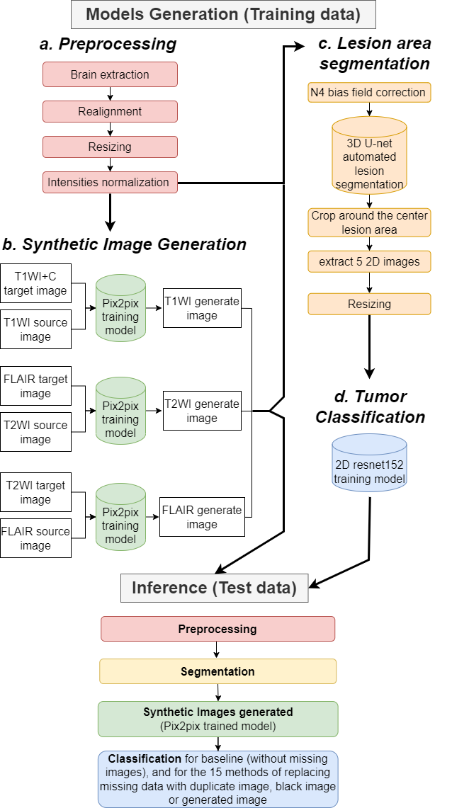

# Handling-missing-MRI-data-in-brain-tumors-classification-tasks

This script

Contact info: yaelher@gmail.com
# Overview
This code is built on fast.ai version 1.6. If you have version 2, please downgrade.

## Data organization
The dataset should include:

**For pix2pix GAN models**

Three folders with the Training images, Validation images and Test images (nifti images) 

**For Classification model**

[Train] folder with the training and validation images and 5 csv/xlsx files with data names ,labels and attribution (train/val).
 
[Test] folder with the test images and csv/xlsx file with data names and labels 

*the images consist of 4 channels: T1WI, T1WI+C, T2 and FLAIR.

## Included files

**For pix2pix GAN models**

<code>T1C2T1_pix2pix.py</code>: Generate T1WI from T1WI+C

<code>T2C2FLAIR_pix2pix.py</code>: Generate T2WI from FLAIR

<code>FLAIR2T2_pix2pix.py</code>: Generate FLAIR from T2WI

**For Classification model**
<code>Classification_5fold_MAin.py</code>: The 5fold classification model on 4 channels

<code>Classification_Inference.py</code>: Predict on test set

## Usage

# Citation
Y.H. Moshe et al., "Handling missing MRI data in brain tumors classification tasks: usage of synthetic images vs. duplicate images and black images", in JMRI (under review) 

# Authors
Yael Hodaya Moshe, Yuval Buchsweiler, Mina Teicher, Moran Artzi

